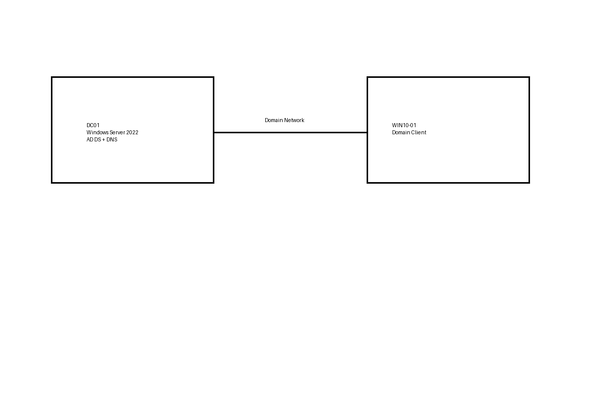

# Active Directory Help Desk Home Lab

## Overview
Enterprise-style Active Directory lab demonstrating real Help Desk tasks.

## Lab Components
- Windows Server 2022 (Domain Controller)
- Windows 10/11 Client
- Active Directory Domain Services
- Group Policy
- PowerShell

## Diagram

## What This Project Demonstrates
- User lifecycle management
- Password resets and account unlocks
- Group-based permission control
- GPO deployment
- Troubleshooting authentication issues

## Resume Bullet
Built and supported an enterprise Active Directory environment, performing user onboarding, account maintenance, and permissions troubleshooting.
